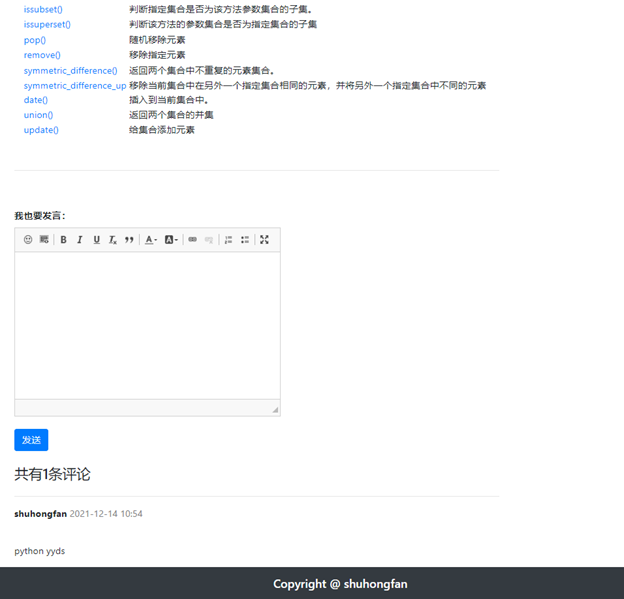
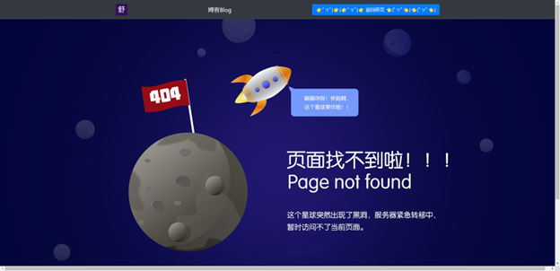

#          Django博客系统  

- 本作品主要实现了一个Django博客系统，采用前后端不分离的项目结构。
- 使用 Django，只要很少的代码，Python 的程序开发人员就可以轻松地完成一个正式网站所需要的大部分内容，并进一步开发出全功能的 Web 服务 Django 本身基于 MVC 模型，即 Model（模型）+ View（视图）+ Controller（控制器）设计模式，MVC 模式使后续对程序的修改和扩展简化，并且使程序某一部分的重复利用成为可能。Python 加 Django 是快速开发、设计、部署网站的最佳组合。
- 前端采用了JavaScript、BootStrap、Vuejs，axios，后端采用Python、Django（开放源码的重Web应用框架），数据存储采用MySQL数据库、Redis、Session技术，
- 系统能够实现用户注册、用户登录退出、用户个人中心、用户修改个人信息、用户重置密码、用户写博客、博客的分页展示、每篇博客的博客详情、用户发表对博客的评论、每篇博客的评论分页展示、用户删除自己的博客，以及用户的权限管理。

##          作品概述  

本作品为一个Django博客系统，开发采用Pycharm编辑器，采用Vue作为前端框架，采用Django作为后端框架，采用Django模板引擎，采用Session和Cookie技术，采用MySQL数据库，采用Redis对验证码进行存储。

本博客系统能够实现：

1. 用户注册（验证码）

2. 用户登录退出

3. 记住我

4. 用户个人中心

5. 用户修改个人信息

6. 用户重置密码
7. 用户写博客

8. 博客的分页展示

9. 每篇博客的博客详情

10. 用户发表对博客的评论

11. 每篇博客的评论分页展示

12. 用户删除自己的博客，以及用户的权限管理等功能。

## 作品概述  

1. 注册（图形验证码验证）

2. 登录（状态保持，Cookie，Session）

3. 个人中心（图片上传，更新数据）

4. 发布博客（数据入库）

5. 博客授课（数据分页）

6. 博客详情（博客详情数据展示，评论功能）

## 作品使用的第三方库

1. Captcha.py （生成python验证码）

2. Django （一个开放源代码的 Web 应用框架，由 Python 写成）

3. Axios （发送Ajax请求）

4. Bootstrap （用于前端页面展示）

5. Vue.js （最火的前端框架，用于数据双向绑定）

6. Jquery （bootstrap依赖jQuery）

.

.

## 总结

通过实现本作品，我学会使用Python的web框架Django开发一个在线博客系统，在制作博客项目的过程中我进一步掌握了Python的基础语法，基本掌握Django的基础语法，熟悉MySQL的基础语法，进一步学习前端HMTL+CSS+JavaScript的基础知识，基本掌握Vue.js和bootstrap的基本使用，更进一步学习HTTP基础网络编程知识，能够使用Axios进行异步页面请求，从Python后台获取数据，并在页面上进行分页展示。

能够使用Django用户自定义模型类生成迁移文件，并通过执行迁移文件在MySQL数据库中生成对应字段的表。学会使用Django默认用户认证系统，它处理用户账号、组、权限以及基于cookie的用户会话。Django认证系统同时处理认证（验证一个用户是否它声称的那个人，可用于账号登录）和授权（授权决定一个通过了认证的用户被允许做什么），通过Django自带的权限管理大大减少我的工作量，使用user = User.objects.create_user(username, password, **extra_fields)就可以创建一个用户，使用user = authenticate(username=username, password=password, **kwargs)就可以进行用户认证，并可以设置密码set_password(raw_password)和校验密码是否正确check_password(raw_password)。

学会使用GitHub上的第三方python包，比如图形验证码captcha，直接在Django进行导入调用‘text, image = captcha.generate_captcha()’即可生成验证码和获取验证码的内容。